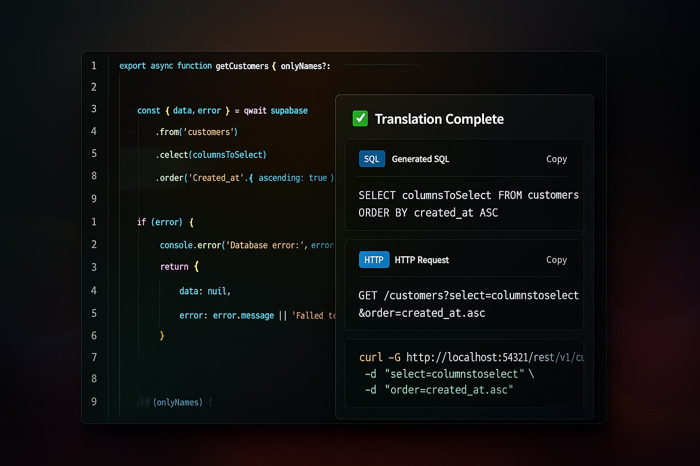

# SupaQuery

A VS Code extension that translates Supabase JavaScript queries to SQL, HTTP requests, and cURL commands in real-time.


## 🚀 Features

- **Context Menu**: Right-click on selected Supabase query to translate
- **Keyboard Shortcut**: Use `Ctrl+Shift+T` to translate selected queries
- **Real-time Updates**: See translations as you type when the webview panel is open
- **Copy to Clipboard**: One-click copying for all translation formats

## Image of the extension in action



*SupaQuery in action: translating Supabase JavaScript queries to SQL, HTTP, and cURL in real-time*

### Supported Operations

| JavaScript | SQL | HTTP | cURL |
|------------|-----|------|------|
| `.select()` | `SELECT` | `GET` | `curl -X GET` |
| `.insert()` | `INSERT` | `POST` | `curl -X POST` |
| `.update()` | `UPDATE` | `PATCH` | `curl -X PATCH` |
| `.delete()` | `DELETE` | `DELETE` | `curl -X DELETE` |
| `.upsert()` | `INSERT ON CONFLICT` | `POST` | `curl -X POST` |

### Advanced Features
- **Filtering**: `.eq()`, `.gt()`, `.like()`, `.in()`, `.contains()`, `.or()`, `.not()`
- **Joins**: Relationship queries with foreign keys
- **Auth**: `auth.uid()` patterns and RLS support
- **JSONB**: Full PostgreSQL JSONB operations

## Quick Examples

### Basic Queries
```javascript
// SELECT
supabase.from('users').select('id, name').eq('status', 'active')
// → SELECT id, name FROM users WHERE status = 'active'

// INSERT
supabase.from('users').insert({name: 'John', email: 'john@example.com'})
// → INSERT INTO users (name, email) VALUES ('John', 'john@example.com')

// UPDATE
supabase.from('users').eq('id', 1).update({name: 'Jane'})
// → UPDATE users SET name = 'Jane' WHERE id = 1
```

### Complex Queries
```javascript
// Relationships
supabase.from('users')
  .select('*, posts(title, content)')
  .eq('posts.published', true)
// → SELECT *, posts.title, posts.content FROM users JOIN posts ON posts.user_id = users.id WHERE posts.published = true

// JSONB
supabase.from('products')
  .select('metadata->>color')
  .contains('metadata', {size: 'XL'})
// → SELECT metadata->>color FROM products WHERE metadata @> '{"size":"XL"}'
```

## Installation

1. Clone this repository
2. Install dependencies: `npm install`
3. Compile: `npm run compile`
4. Press `F5` in VS Code to run in development mode

## Usage

1. **Context Menu**: Select a Supabase query and right-click
2. **Keyboard Shortcut**: Select a query and press `Ctrl+Shift+T`
3. **Real-time**: Keep the webview panel open for automatic updates

## ✅ What Works Great

### Simple CRUD Operations
- **Basic SELECT**: `supabase.from('users').select('*').eq('status', 'active')`
- **Simple INSERT**: `supabase.from('users').insert({name: 'John', email: 'john@example.com'})`
- **Basic UPDATE**: `supabase.from('users').eq('id', 1).update({name: 'Jane'})`
- **Simple DELETE**: `supabase.from('users').eq('id', 1).delete()`
- **Basic Filtering**: `.eq()`, `.gt()`, `.lt()`, `.like()`, `.in()`

### Perfect For
- Learning Supabase query syntax
- Quick SQL translation for simple operations
- Generating HTTP/cURL requests for basic CRUD
- Understanding how Supabase queries map to SQL

## ⚠️ Current Limitations

### Complex Features (Coming Soon)
- **Advanced Joins**: Complex relationship queries with multiple tables
- **Nested JSONB**: Deep JSONB operations and queries
- **Dynamic Queries**: Queries built at runtime with variables
- **Ternary Operators**: Complex conditional selections

### HTTP/cURL Limitations
- **Authentication**: No auth headers included (use your own API keys)
- **RLS Policies**: Cannot account for Row Level Security
- **Base URL**: Uses localhost; adjust for your Supabase project URL

## Architecture

```
src/
├── parser/              # AST Processing with ts-morph
├── sql-generator/       # SQL string assembly
├── enhanced-translator.ts # Translation pipeline
├── http-translator.ts   # HTTP/cURL generation
├── webview-provider.ts  # VS Code webview
└── extension.ts         # Main extension
```

## Testing

```bash
npm run test:unit
```

**97 test cases** covering CRUD operations, filtering, joins, auth, JSONB, and edge cases.

## Dependencies

- **ts-morph**: TypeScript AST parsing
- **@supabase/sql-to-rest**: HTTP translation (SELECT only)
- **@types/vscode**: VS Code extension types

## Contributing

We welcome contributions! Please see our [Contributing Guide](CONTRIBUTING.md) for detailed information on:

- Setting up your development environment
- Code style guidelines
- Testing requirements
- Pull request process
- Areas for contribution

Quick start:
1. Fork the repository
2. Create a feature branch
3. Add tests for new functionality
4. Submit a pull request

## Roadmap

### 🎯 Phase 1: Perfect Simple Queries (Current Focus)
- [x] Basic CRUD operations (SELECT, INSERT, UPDATE, DELETE)
- [x] Simple filtering (.eq, .gt, .lt, .like, .in)
- [x] Real-time translation updates
- [x] Copy to clipboard functionality
- [ ] **Better Error Messages**: Clear, helpful messages for common mistakes
- [ ] **Query Validation**: Catch syntax errors before translation
- [ ] **More Examples**: Comprehensive examples for each operation type
- [ ] **Performance**: Optimize for fast, reliable simple query translation

### 🚀 Phase 2: Enhanced Simple Features
- [ ] **Copy All Results**: One-click copy for all translation formats
- [ ] **Result Persistence**: Save results between VS Code sessions
- [ ] **Export Options**: Export to JSON, markdown, or plain text
- [ ] **Theme Integration**: Better dark/light theme support
- [ ] **Keyboard Shortcuts**: Additional shortcuts for power users

### 🔧 Phase 3: Gradual Complexity (Future)
- [ ] **Basic Joins**: Simple relationship queries
- [ ] **JSONB Support**: Basic JSONB operations
- [ ] **Range Operators**: .gte, .lte, .between
- [ ] **Ordering**: .order() support
- [ ] **Limiting**: .limit() and .range() support

### 🛠️ Technical Improvements
- [ ] **Test Coverage**: Comprehensive tests for all simple operations
- [ ] **Documentation**: More examples and troubleshooting guides
- [ ] **Error Recovery**: Graceful handling of edge cases
- [ ] **Performance**: Faster parsing and response times

> **🎯 Focused on Simple Queries**: This extension is designed to handle basic Supabase CRUD operations reliably. While complex queries are being worked on, the current version excels at simple, everyday database operations that most developers use 80% of the time.


## License

MIT License

---

**Built with ❤️ for the Supabase community** 